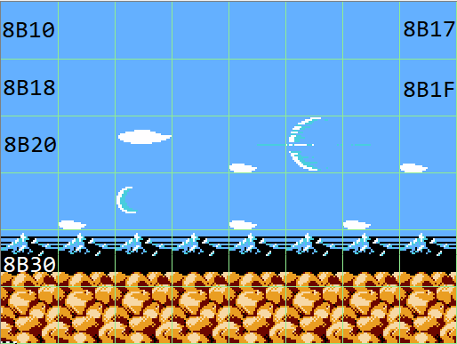
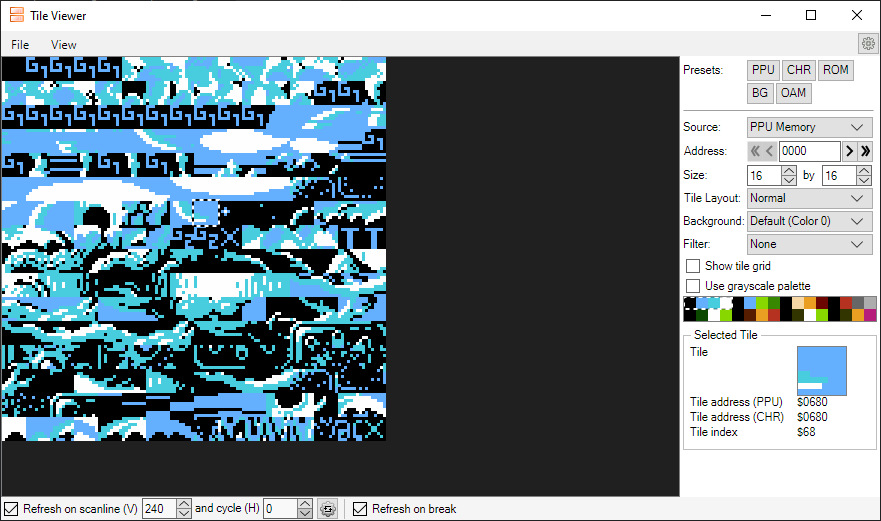

# How to Hack Bucky O'Hare

There are many guides out there for ROMhacking, but I decided to write this guide as well because I'd often find information to be quite scattered and varying in quality, making it hard to piece together. I think by writing it down it also helps reinforce to myself that I actually understand what I'm doing. I know this won't all apply to every NES game, but I believe it should extend to many games beyond BOH.

## Tools Used

- **Mesen**: An emulator for NES (and other systems) that has a lot of debugging tools. I'm sure other emulators have equivalent tools, but probably use different names for them.  
- **Tile Layer Pro (TLP)**: A simple graphics editor program that can load a game's graphics in tiles organized by their addresses in the CHR ROM.  
- **Cygnus Hex Editor**: A program that opens ROMs as binary files (an exact sequence of its compiled bytes, in hexadecimal). I'll just use the term "hex editor" in this guide since I didn't find anything particularly remarkable about Cygnus, and there are many hex editors out there.  
- **TBLater**: Program to create *.tbl files, although these are pretty easily made in any text editor.

## Key Terms and Concepts to Know

These are a mixture of generally accepted ROMhacking terms, with me taking some liberty on a few to define them how they most make sense to me.

### Binary, Bits, Bytes, Hexadecimal, etc.

Sorry, I'm not going to go into much detail on these, since they are a fundamental concept beyond ROMhacking that has plenty of resources out there, and mostly because I already knew enough that writing it down doesn't help reinforce it for my own use. I will say a lot of the hacking doesn't require much specific knowledge of it anyway.

### Tile

A tile is an 8 pixel by 8 pixel graphic. The tile can use four different colors, which are defined by palettes. Every graphic in the game is made up of tiles assembled together, whether it's scenery or sprites, but most of the time when I say "tile" in this guide I'm specifically talking about its use for scenery.

### Sprite

I'm defining sprites to refer to things like playable characters, bullets, enemies, etc. (there is a distinction functionally in the NES as well), but note it isn't uncommon to see people refer to sprites broadly as all NES graphics.

### Palette

A palette is a set of four colors which can be applied to a tile. At a given time, in the game's memory there are four palettes used for scenery tiles and four used for sprites. Palettes are actually more like three colors each, I think that most (all?) of the sprites use the first color for transparency, and tiles use the first color for black.

### Metatile

A metatile is a 4x4 cluster of tiles (totaling 32x32 pixels) that is used to form the displayed scenery.

## How to Edit Levels

TODO: For now, this section is limited in scope to replacing tilesets within existing level constraints. Any adding entire new sections of the level, changing fundamental game behaviors, enemy placements, etc. is not covered here.

There are three main ways I'd recommend to edit a level, and aside from how, it's important to know _when_ to use the right method. The methods I will cover are:

1. Change the placement of metatiles.
2. Change the tile makeup of metatiles.
3. Change the tile designs.

### When to Use Each

The easiest way for me to explain this is through examples. 

Let's say you want to remove all the clouds from the game's sky and make it look clear. When I was first learning, I would do **(2) Change the tile makeup of metatiles** to blank out the ones with clouds, but learned the hard way this is not the best approach. Because the game already had a metatile defined for a blank sky, it was better to instead use that one, aka **(1) Change the tile makeup of metatiles**.

If you wanted to _add_ clouds to the game, the approach would be similar, unless the game didn't have clouds already. Then it might be appropriate to **(2) Change the tile makeup of metatiles**, but keep in mind you'll probably need to have another metatile to "sacrifice" to add clouds to one (at least to keep the level size the same in ROM and avoid the complication of expanding it).

If the game already had clouds, but you want to change the look of them (maybe make them look fluffier, or simpler), then **(3) Change the tile designs** is the right approach, but **(2) Change the tile makeup of metatiles** and/or **(1) Change the placement of metatiles** could also apply if you want to make the clouds bigger.

And with that in mind, let's get to the how for each of these...

### Change Placement of Metatiles

Let me introduce the Tilemap Viewer, a feature of the Mesen debug menu. (NOTE: You may have to pause and unpause the emulator repeatedly to get the graphics to show up properly, I think this is something to do with how the bottom status bar renders as a "competing" set of graphics.)


The "Tile Index" address and "Tile Address (CHR)" values underlined will both come in handy with level editing. The checked "Show attribute grid" option is showing the metatile boundaries.

So we can see that tile $50 is a completely light blue square. We can do this with any of the tiles on the screen and get their index as well. Let's zoom in on a slightly more complicated metatile to demonstrate this:


Using a hex editor, we can search for these 16 indexes in sequence and note they appear around ROM address $82D0:


TODO: I don't know exactly how to find the "home" metatile index, but I do know they are relative. So if $82D0 corresponds to $0C, then $82E0 is $0D; $82F0 is $0E, etc. It seems that the first metatile definition is $00.

If we repeat this process for each metatile, we can track down their metatile indexes. Then, the placement of the game's graphics is defined by an order of metatiles, kind of like how the metatile is an order of tiles; it's just a scaling up of that concept.

Here it is illustrated with an example - this is a cluster of 16 metatiles, with indexes:


And of course, this sequence shows up in our ROM:


For demonstration, let's get rid of the clouds in this set of metatiles - success!


So a single "screen" is made up of three rows of 16 bytes in the hex editor, or rather six rows of 8 bytes as it's displayed in game. Here's a visualization of this:




This continues on down the ROM as you scroll to the next part of the screen. Also note in the below screenshot that the "Show scroll overlay" option is very helpful, especially because sometimes the screen displayed in the Tilemap Viewer can wrap over to the other side.


As far as I can tell, the order of the bytes in ROM is the order that screens load in the game. So if a section scrolled vertically upwards, the _bottom_ screen would actually come earlier in the ROM than the top screen. But each individual screen worth (the six rows of 8 bytes) still has the top of the screen in the earlier bytes.

TODO: I don't know yet about how parallax screens might behave differently.

### Change the Tile Makeup of Metatiles

If you read and understood the prior section, this one may come as pretty intuitive at this point. Just like we can change what metatiles make up a strip of one "screen", we can change the tile that makes up a metatile.

You can open the Tile Viewer (Pattern Table) by right-clicking in the Tilemap Viewer, or from the main Mesen Debug menu. 



You can see what tiles are available for use, with indexes for each. To change a metatile, you would just replace tile indexes with the indexes you want to use to make a new graphic. Sometimes you might need to change the tiles themselves to be able to produce what you want, which is covered in the next section.

I will reiterate that for my purposes, I kept all the tiles and metatiles within their existing constraints. This means that you inevitably need to sacrifice something to free up the space. Sometimes there will be unused tiles anyway, but it's very important to be careful that tiles that _appear_ unused aren't actually used in another part of the game. This is what I created my [Pattern Tables](./Pattern%20Tables.md) document for.

### Change the Tile Designs

With TLP, you _could_ scroll through the loaded ROM and visually identify tiles, but it's really hard to identify anything other than text, since very few complete graphics are made up of just one 8x8 pixel tile. Instead it's easier to get the "Tile address (CHR)" value from Mesen debugging. TLP has an option to jump to an address, though it's important to make sure to pick the "Relative" option if the ROM doesn't start at $00000.

Once you have found a tile, it's pretty easy to edit in TLP. Keeping the colors straight can be tricky - the colors displayed in TLP have no factor on how they show in game, other than color 1 is always color 1, color 2 is always color 2, etc. You can change the editor colors to visualize better with the game as needed. The other tricky part is visualizing how they will all fit together; it's easiest whenever possible to start with replacing graphics to fit in the same tile grouping sizes as the original.

### Change Tile Colors

There are a few ways you can change the colors of tiles. The simplest way is to change the palettes themselves. Open up the Palette Viewer in the Mesen debug menu and the first four are for the non-sprite tiles. You should be able to find these in the PRG ROM by searching for them with the first byte omitted, i.e. 21 2C 20 for 0F 21 2C 20. If there is only one result that's your palette; sometimes a palette could appear twice, or there's a low chance of it being some totally unrelated data. I noticed the palettes seem to be in order, so seeing bytes from the other palettes in the group can also help. You can then replace the bytes you want to change with the bytes that correspond to the desired color. Another option is to edit the tile itself to change the colors used.

Of course, this is pretty limiting, since everything that uses that palette gets your new colors. Sometimes you'll find as you change scenery that you get weird color mismatches, which the next section can help with.

#### Changing Palettes Used by Metatile

For palette purposes, we can actually divide up a metatile into four 2x2 tiles, which Mesen shows with the "Show attribute grid (16x16)" option selected. The below screenshot demonstrates some of these tiles with different colors.


The four palettes can be thought of with the numbers 0-3. Since there are four possible tiles for each of the four attribute tiles in a metatile, a metatile can have 4<sup>4</sup> combinations of palettes, or 256, or one byte.

To define a specific set, I got my info from [here](https://www.nesdev.org/wiki/PPU_attribute_tables), although I had a difficult time understanding the left shift at first. Instead I have made a table of all the possible values rather than calculate them each time.

| Palette | Location | Shifted Number
| --- | --- | --- |
| 0 | Any | $00 |
| 1 | Top Left | $01 |
| 1 | Top Right | $04 |
| 1 | Bottom Left | $10 |
| 1 | Bottom Right | $40 |
| 2 | Top Left | $02 |
| 2 | Top Right | $08 |
| 2 | Bottom Left | $20 |
| 2 | Bottom Right | $80 |
| 3 | Top Left | $03 |
| 3 | Top Right | $0C |
| 3 | Bottom Left | $30 |
| 3 | Bottom Right | $C0 |

So if you wanted to use a palette pattern such as:
```
30
21
```

The byte for that address should be set to $03 + $00 + $20 + $40 = $63.

TODO: Explain how to identify _where_ these bytes are. I haven't found a great method yet, I initially discovered them through ROM corruption. One thing I observed is that since they can encompass the full range of a byte, you might see a lot of values like $00, $AA and $FF near each other, which isn't as common for other types of level data.

## Editing Font

Text tiles were easy to find in TLP in my case, for both the source and destination game. The only thing I learned to watch out for is that sometimes text can appear in multiple places (for reasons I don't entirely understand), so it's best to scan the whole thing before starting to replace text. The tiles are easy to replace since each character is a single tile.

## Identifying Game Script

1. Open the Tile Viewer in Mesen when the game is running.
2. Note where alphabet and number characters' "Tile Index" begins - in this case from address $01.
3. Create a table file with them starting A at $01 thru Z, then 0 starts at $1B
    - Table files take the format of `01=A`, `02=B`, etc. (one entry per line) with a *.tbl file type.
4. Open the Mesen Memory Viewer, select the PRG ROM, load the table file in, and when scrolling through the script should eventually be visible on the right side.

### Editing Game Script

I can edit the game's script by replacing the address in memory with the tile index address of the desired letter, but I'm not sure how to go beyond the scope of the space I already have. I would likely have to shift the entire ROM which undoubetdly would have a lot of consequences. Or stick the new script at the ROM's unused memory and find a way to use those addresses instead.