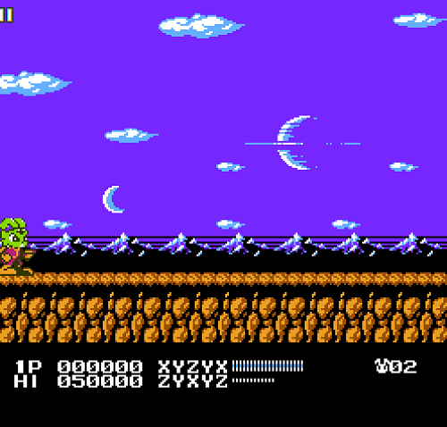
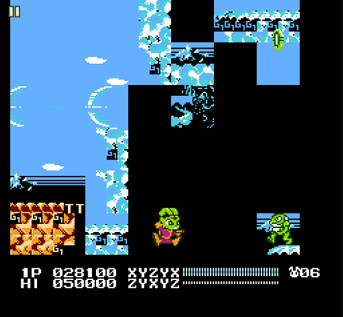
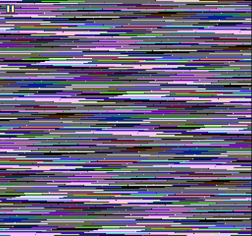

# Mega Bucky Devlog 1

This is my first development log for my "Mega Bucky" ROMhack of Bucky O'Hare. Each devlog has no particular time or milestone constraints on when I end them, I just make another one when it feels like one is getting too big.

## 7 Jun 2024

Start of development! This was a productive day with some "easy wins".

Replaced text chars from mostly Mega Man 2, some additional punctuation from Mega Man 4. Here is what it looks like before and after the change:

I also made the life/power meters mor "Mega Man"ish. Instead of changing color to indicate fullness, I wanted it to deplete completely. There is one issue with that: In MM, the meters usually have a black outline and black spaces in between, which works because they're rarely put over a black background. But that's not the case in Bucky. One option would've been to give them a fourth color outline, but then it's not possible to give an overall outer vertical boundary - only lines between that would end up showing each "chunk" of the meter. I ended up doing something a bit inexact and having the depleted bars shrink a bit. Original game vs update:

## 8 Jun 2024

My second day of development had me hit quickly with the discouraging realization that I may have already exhuasted the easy changes. As a manner of productive procrastination, I played through the game again, recording save states along the way for nearly every screen. While I know the concept of save editors exist, the game is short enough that this was probably much quicker than tracking down or engineering one of my own. It was partly a stalling tactic, but I do think having a quick load into each part of the game is sure to come in handy with the project.

The rest of my efforts were mostly spent poring through the Mesen debugging documentation, although I am not sure I learned much, as the main challenge is making sense of the various hexadecimal values encountered in basically all of the tools.

This is not a permanent change, but an example showing I found how to change the colors. Our heroes in Bucky get a remake in the image of our favorite Blue Bomber. Unfortunately it doesn't work very well. Aside from the color distribution being off, I saw most of the characters' bullets took on the new color as well. The base palettes of the sprites could certainly be changed to make it look better (i.e. Willy and Jenny's shoulders, Deadeye's hat), but I'm not so sure about the bullets being as simple.

  
   

## 9 Jun 2024

Not much here to demonstrate visually, but a considerable amount learned in sprite editing. I started identifying the memory addresses of the playable characters' sprites, so far just for their standing and jumping animations.

I also pulled the equivalent sprites from Mega Man and replaced the 1UP, Power and Life sprites. No screens for now because I eventually reversed course, as it might actually be a pretty big challenge. First is the fact that in MM, they blink in place, but the standard Bucky sprites actually use smaller ones mid-rotation. Secondly, the color palette mapping is gonna be an issue.

## 13 Jun 2024

I figured out how to edit the game's script. I'm not sure I'll make this a permanent change since I might change the text altogether, but as practice I fixed the "FLYS" typo at the end of the game:

This was not actually as easy it might seem, because there wasn't actually any additional room on that line in the game's ROM. There might be multiple ways to handle that scenario, but what I ended up doing was realizing in the prior screen that "MOTHER SHIP" could be fixed. Thus by removing the space, it freed up room for me to a character, which I accomplished by moving everything back a byte after "MOTHER".

## 15 Jun 2024

It isn't much, but I made my first attempt at replacing tiles with something from MM. In this screen, I used assets from Blizzard Man's stage (MM6) with slight alterations.  

There is still a lot of work that could be done here, such as changing the sky, or making these look like stacks of blocks rather than being continuous.

## 22 Jun 2024

Added an underwater ice block to match the above surface ones.  

## 4 Jul 2024

Something I realized is that all Mega Man games have a "square" terrain aesthetic. On my Blue Planet changes I've arleady made, it was fairly easy to replace tiles since that was already square. So I've made it my goal for now to first make levels rectangular before I change the tile aesthetics.

I started out by identifying tiles that are, for example, part of the "taper off" of these cliffs. I replaced them with "G1" in this case (Green Planet Act 1). There will be more, but I'm not going to take screenshots of this going forward, this is just a little demonstration:  

My reason for doing this is that these tiles won't be displayed once I fix the terrain to be more square. But in case I need the tile space later on for some other graphics, I didn't want to leave them as-is in ROM, so I changed them to something that will be much easier to find in TLP.

Here's an example of a more squared off Green Planet Act 1, for now I'm going to leave the floating cliffs like that until I replace the graphics with MM ones. I thought this blue/white corner was a bug, but the original palette was like this, so I need to figure out how to change its palette.  

## 5 Jul 2024

Today I changed gears and tried to figure out the score. I did find where the score is stored in _RAM_, but I wanted to find it in ROM instead so I could, for example, see if the high score can be set to 0, or change the score value for killing an enemy, but no success yet.

I have a hypothesis that the 50000 (dec) high score value is actually stored as an $05 value somewhere. I wanted to see how often $05s are read from ROM to load in this score, and assume it's either at boot up or start of a level. The value $05 is also used for the letter E in text, so I tried clearing out the game's copyright and title screen text. These aren't exactly how I meant to change them but these are the results:

  

The second screen is notable because I accidentally corrupted the game logo's palette, so I might be able to revisit this to glean how to select palettes.

A more definitive change is one I made in the bottom bar. These letters are nonsense, it was more just for the sake of making sure I could do it - but I kept the change since I have plans for a bigger overhaul here anyway.

## 6 Jul 2024

Another day without any big "milestone" progress, but I am furthering my learning on diving into the RAM, and determined where lives, power and health are stored. I also created a repo for this project and started straightening out the documentation.

Revisiting something from yesterday, I tracked down where the title screen logo palette is set. It turns out that was a single byte, and if I change the byte value I can get various results. This does concern me a bit that I might not have as much palette control as I need, but I don't fully understand how this works yet. As seen in the screenshot below, sometimes the palette setting can also screw up the positioning of the text.

## 7 Jul 2024

Today I went back to replacing tiles in the Green Planet's first act. I chose tiles from Hard Man's stage in MM3. This is an example of how I'm concerned about palette control, as this is what it looks like when I try to change to the palette from MM3:

Those blocks are there from the original graphics where the platforms went down in a V shape. But with the game's original palette then I get too much purple where I don't want it:

## 8 Jul 2024, 13-14 Jul 2024

Identified the pattern tables for the whole game, which are detailed in their own document.

## 14 Jul 2014

I made a little change to the Green Planet clouds, just looking for some simple bit of progress I could make. I made them a single color since that's a common look in MM, but then I wasn't satisfied with the sky color. I messed around with that a bit but I'll probably change it again later on.

Then I decided to corrupt a part of the ROM, which is basically giving it a bunch of bad bytes and seeing how it is affected. This helped me identify some of the level data in the region I corrupted. It produces a result like this:

### 15 Jul 2024

More data corrupting, mostly in areas I suspect are _not_ level data. It produces a ton of interesting results (and crashes), but here is just a small sample. Some of them aren't really possible to capture in a single screenshot either, such as the way the screen jitters all over the place in some corruptions.

  
  
  

### 16 Jul 2024

Continued data corruption. This has been a bit tedious, and now that I've started to get into actual game logic, I'm not sure if there is as much value since that probably can't be edited directly in the ROM (as opposed to assembly code). Nonetheless, I hope it is useful in the long run to have an idea of how the ROM is sectioned out. And I had some fun seeing bugs, though these screenshots don't really capture the best ones.

  
 

To this point I think I've generally located all the level tile data, but still need to parse out what it all means. I _might_ also have the sprites for each level, but it's even more confusing to parse. The one remaining thing I hope I can find through corruption is the sounds and music, if it'll be possible to get them to not play without otherwise breaking the game.

### 17 Jul 2024

Yet more corruption, but this time I had some success corrupting the music and sound effects. At this point, I am going to move on to trying to make sense of the sections of the ROM I've corrupted rather than continue with seeing what more corruptions will affect.

## 19-20 Jul 2024

Figured out how to change the colors on metatile groupings (the 4x4 tile or 16x16 squares that make up a level), although I need to determine _where_ these groupings come from.

Here is an example of me creating a pattern of palettes 0, 1, 2 and 3 from left to right, top to bottom (or 1, 2, 3, 4 if you prefer, though they are 0-indexed in the software):

## 21 Jul 2024

I made some progress towards understanding the above point on why specific tile groups are affected by the color change, but I need to put it into action. Relating to this, I also realized that rather than changing the metatile _definitions_ to suit my needs, I should change which metatiles are _selected_, which I now know how to do. Given that, I went back and undid some of my previous changes to try to square off the floating cliffs:

I of course haven't yet fixed the above. But I did try on a simpler tileset to prove it out, removing some clouds for now (before and after):

  

## 22-23 Jul 2024 

Cleaning up the documentation and ironing out some of my understanding of the above concepts through hex edits. There are no definitive changes to show, as my focus for now is getting my knowledge base into a good state.

## Conclusion

With this, I've decided to end this devlog, but there will be another one when work resumes. In about a month and a half on this project, I learned a decent amount about level editing (and a few other things), and documented it down for myself to be able to pick up later. I intend to slow my development for now, if not go on hiatus outright. This project is time-consuming, and makes more sense to spend more time with in the colder months.

Progress wise, the change of the game's font was my most visible change, but this early stage of development is front-loaded with learning. There is still a lot more I will need to learn to realize my vision, but I'm happy to be at a point where I can theoretically make most of my level edits and just need to put that skill into practice.