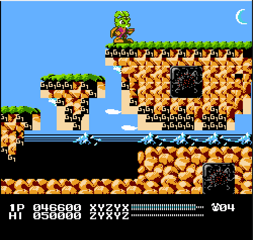

# Mega Bucky Devlog 2

It's not exactly a hiatus, but after over a week break, I'm back working on it.

## 2 Aug 2024

The recent news about romhacking.net effectively shutting down was a potential big blow to the project, as I'm now left wondering where I'll host the hack once I'm ready to release it. At least I know that will be a ways off with how much work remains, so hopefully a suitable successor will emerge in that time.

Initially I started out trying to identify every metatile for Green Planet, but then I realized how time consuming this would be. Instead, I ended up deciding to replace pretty much everything but the level ground/platforms. It is much easier to do that and doesn't require as precise knowledge of what each metatile is. I was initially afraid of making metatiles hard to identify for later on, but I realized that it's better to just wipe them out anyway and change background graphics entirely.

Here is what one act of Green Planet looks like with this. I put a moon metatile at the top right of each "screen" to have an easy identifier for where each cutoff is.

 
 
 
 
 
 
 
 
 

That is a lot of screenshots, so as I continue with this going forward, I won't post them for each screen. I also did the same for the second act today.

## 3 Aug 2024

Continued through Green Planet cleaning up backgrounds. I skipped through some areas, like Act 3, since the tree backgrounds are also closely tied to the platforming. Started into Red Planet. Green Planet Act 5 and the beginning of Red Planet both make things slightly trickier with parallax. 

Also spent some more time trying to plan out more level changes and determine good MM source material for them. Did some reorganizing on how I document these plans.

## 4 Aug 2024

Changed the waterfall texture and color in Green Planet. See below:

 

A little bit of corruption and documentation reorganization today as well. Now I'm at a point where I have a lot of the technical know-how to edit level tiles, but choosing the right graphics is the hard part.

After a break, I came back and revisited an old area - with better knowledge of how to configure the tiles, I was able to get most of the Blue Planet ice blocks looking how I wanted.

## 23, 26 Aug 2024

Not a lot of big updates here. I decided to dig in a bit more to how nametables work and what utilities are out there, as I'm hoping that with the right configuration they'll make editing levels much more efficient in the long run vs. continuing to transcribe the metatiles and edit the hex by hand.

## 31 Aug 2024

I was unable to easily get a tool that would help me edit levels, so I went back to doing them the slow way. I changed how a fireballs looks in Red Planet.

## 7 Sep 2024

I made some updates to the Cell level. Some blocks I grabbed from MM2, and some palette changes, plus making the falling trap blocks more noticeable.

Updates to the conveyor belts. I did both later on but this shows the difference; mine is on the left. I added the arrow because it moves so fast it's hard to tell the direction with the new sprites. Hopefully I can make it slower later on.

My palette changes to the blocks and conveyors have messed with palettes for other scenery, but I don't care for now because I need to redo the background anyway.

## 13 Sep 2024

Changed the look of the spikes in Cell. The downward facing ones are new, upward are old. Might also change their color eventually.

Also changed these flashing spikes in the elevator ride in Cell:

## 14 Sep 2024

Simplified spike design in upper part of Cell elevator ride:

## 20 Sep 2024

Found a .nsf file for the game's audio, then imported it to create Famitracker files for each song in the game. I don't know much about using trackers at all, and not sure if I'll mess much with the audio right now, but I decided to at least dip my toes in.

## 21 Sep 2024

Went back to the Blue Planet and updated the submerged ice blocks, which use a different sprite than the above-surface. Then I thought it looked weird. It's a little weird in the original game too, as you fall through these and die, even though it would appear like you could stand on them. I compromised and took them out entirely; not sure I love it, but there's no perfect choice.

 

I continued going through Blue Planet and took out the clouds and moons in Acts 1-5, but didn't really feel like it was interesting enough for screenshots.

## 2 Nov 2024

My first day back in a while was a disappointing one, with some lessons (re)learned. I wanted to replace the snake designs with the snake terrain from MM3. I started on that by making the tiles more clearly identifiable by their position and direction:

 

This was foolish of me, and I should have already known so, for two reasons. The first was that the tiles don't map 1 to 1 with the tiles from my MM3 source, which is very often likely to be the case, even if the metatiles are the same size (by this I mean that, for example, Bucky might use 4 unique tiles in one section of the snake "body" while MM3 will use 8, etc.).

The thing I should've done from the start is identify the metatiles in Bucky and plan to redefine them so they could fit the mold. But alas, I couldn't find any metatiles for the snake body. I think this is because they are drawn as the snake moves, even though they end up as tiles when they appear. So I am not sure how to redefine the snake body, effectively putting me back where I started for the day's progress.

## 3 Nov 2024

I regrouped and was able to make the snakes work okay with the existing tile makeup. It certainly isn't 1:1 but it lifts a lot from the MM3 look. The heads of the snakes are still unaltered.

 

## Conclusion

Sadly, I didn't get any more work in for the rest of the year, but hopefully the time away will re-energize me for the project. This seems like a fitting place to end the log, until next time!

[Next >](./devlog-3.md)
