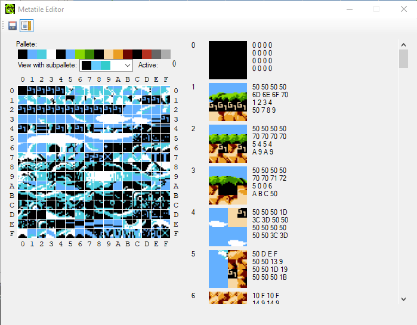
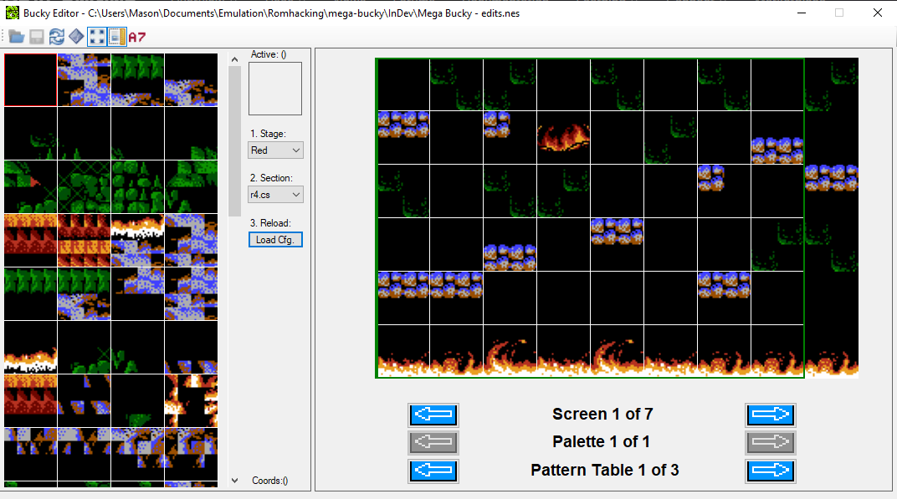
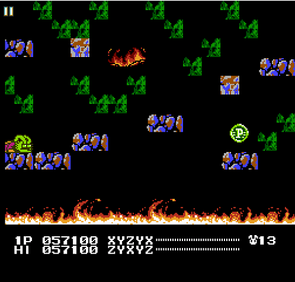
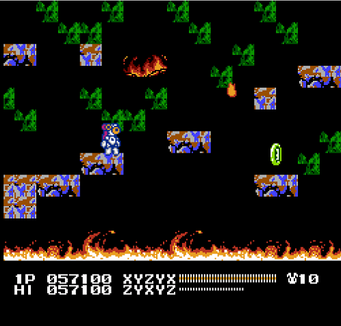
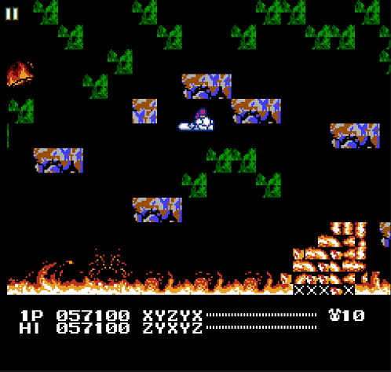
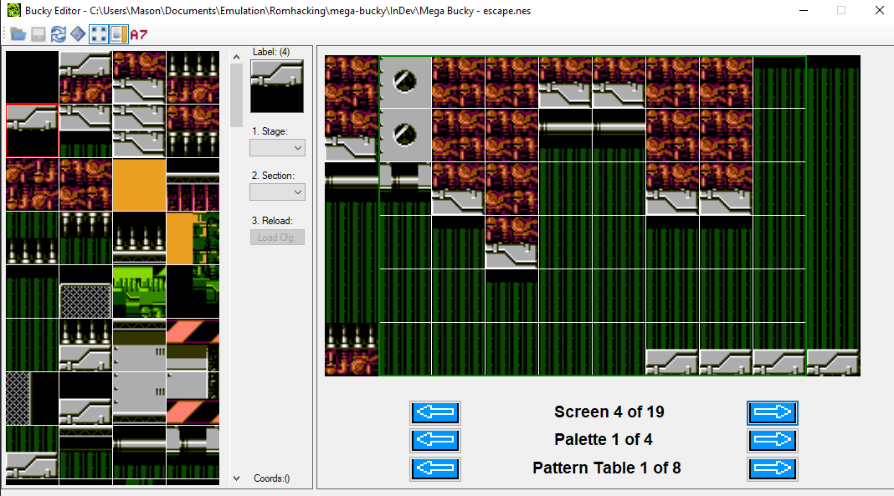
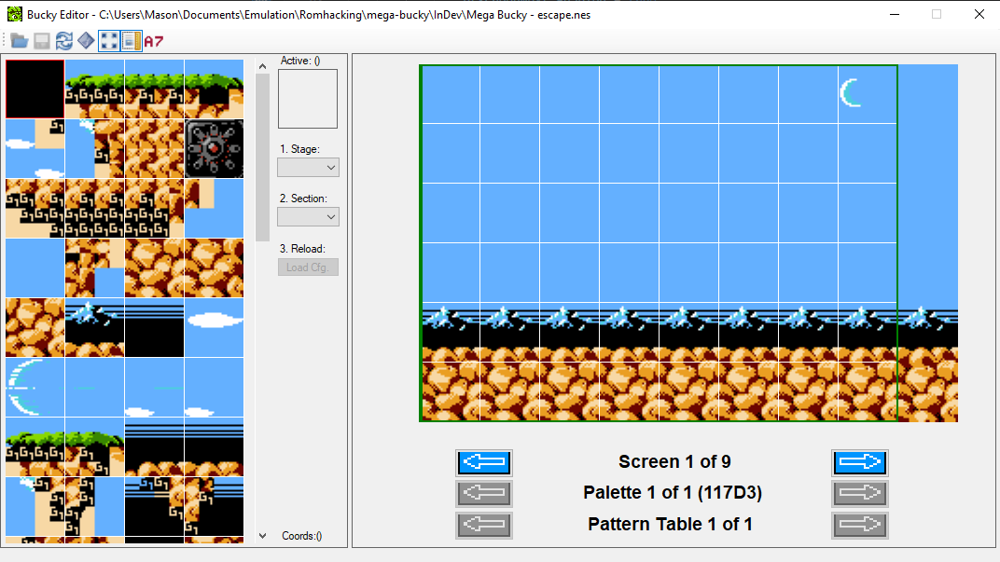
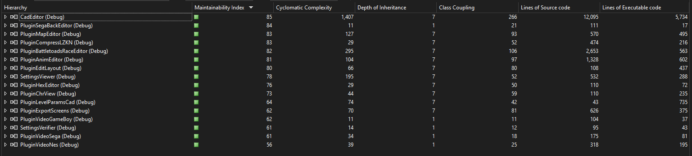
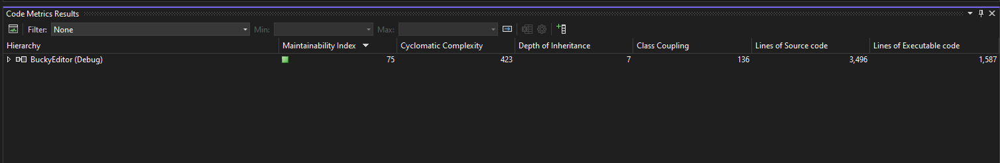

# Mega Bucky Devlog 3

## 1 Jan 2025

My long gap without working on this was partly due to discouragement at the thought of the tedium to how I was editing levels - so I finally made more of an effort to seek out a level editor. I found one that looks promising, but want to modify the source code to better suit my needs and work out some issues it has. So today's work was spent on stripping it down a bit, but there remains work to do on that front still.

## 2-8 Jan 2025

Continued refactoring of level editor. I coincidentally worked on it a few days in a row, until realizing it might be nice to do that on purpose, so for now I'm focusing on making smaller edits each day.

## 9 Jan 2025

Milestone in the level editor reached - it's now loading palettes and tiles directly from ROM! Previously, it loaded these from a fixed binary file, so they would never be up to date with my edits.

## 10 Jan 2025

Updated the level editor palette colors to match the Mesen emulator colors.

## 11-16 Jan 2025

Creating new config files for the levels to use in the level editor.

## 17-20 Jan 2025

Additional enhancements to level editor to accomodate some special level cases. I re-implemented the ability to select different palette and pattern table sets as buttons (and different internal loading logic); these were formerly under the "Advanced" checkbox. Screens are also buttons instead of a dropdown box now.

## 21 Jan 2025

Converted more things to icons. First, the show metatile address checkbox from above:

I did a similar thing for the metatile editor, which didn't have image based buttons at all, and also added the ability to toggle gridlines:

## 22 Jan 2025

Initially I thought the level editor was in a good enough state to take a break from working on it and actually _edit_ levels, but I got hit with writer's block pretty fast. I made some minor changes not worth showing yet. I also realized that the editor still could greatly benefit from some features I initiallly thought of as "nice to have". So updates going forward will probably be a mix of actual game work and work on my editor.

## 23 Jan 2025

Got the metatile portion of the editor displaying addresses of the individual tiles. It's a bit low tech, but they're small, so overlaying addresses wouldn't have really worked as well as it does with metatiles.

## 24-25 Jan 2025

Doing some design planning on levels and made an update to the level editor to select configs from a drop down rather than browsing the file directly. Now I can choose a stage and it will populate the available config files for that stage.

## 26 Jan 2025

Trying to simplify the graphics so they use the same tiles (or at least fake like they are). The first attempt at this resulted in instant death blocks and I thought I knew why, because I was using a different metatile address. So then I rebuilt the metatiles into the proper address, but... it's still the same result, leaving me now wondering if individual _tiles_ have "deadliness" properties, when I assumed it was per metatile.

A little experiment to test this - I half replaced with the "safe" tiles and yeah, I can walk on top but die when touching the underside.

  

This is good info to know but will make my intended edits more challenging, and now I have a further need to figure out how to set tile "physics" properties.

## 27 Jan 2025

Trying to determine more about how key data is stored. I want to either find where the pattern table for a given act is chosen, so that I can switch to that pattern table, or find the tile attributes so I can make the appropriate tiles "safe".

## 28 Jan 2025

Updated tiles in Escape to reduce the shadow size - these used to be two tiles high and now are just one:

I also changed the colors here to change between very subtly different greens only. It used to go between green, blue and purple, but I found it changed in a bit of an annoying way to look at.

## 29 Jan 2025

Struggled to debug to find how to change pattern tables, and didn't get a definitive answer on forums yet either. I made a minor editor change instead, adding a convenient display of palette addresses:

## 30 Jan 2025

Fixed some bugs I realized I introduced in the level editor, and some other little editor cleanup.

## 31 Jan 2025

A few more level editor enchancements. With that, I successfully completed a full month of working on this every day! Although most of it was for the level editor, I think it'll pay off in the long run.

For fun: A comparison of code metrics generated by Visual Studio. This is the level editor as it was when I first forked it vs. my changes to this point. I don't know if these mean all that much but it was fun to see the change. Of course, there was also a loss of functionality (due to things that don't apply to Bucky O'Hare) that comes with these changes. I find it funny that that all the numbers where it says lower is better went down, and yet maintainability index also somehow decreased, which is the one metric where it says higher is better.

  
