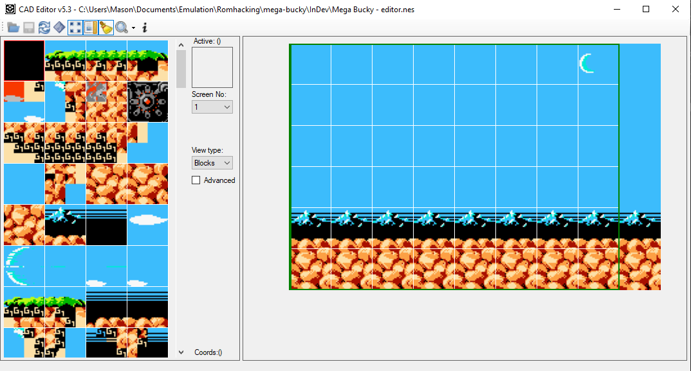
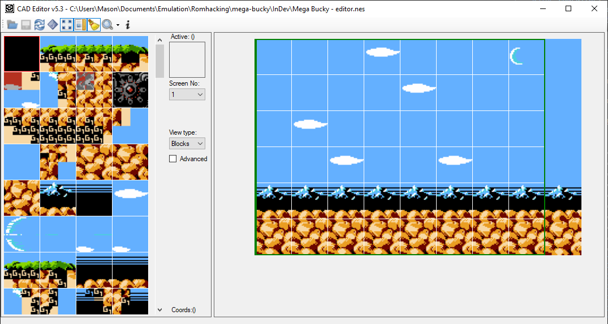
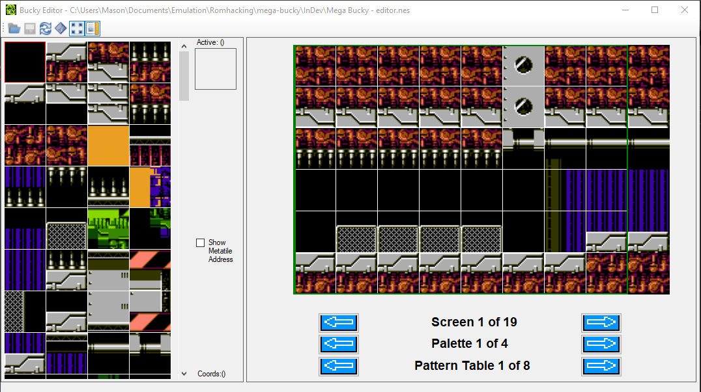
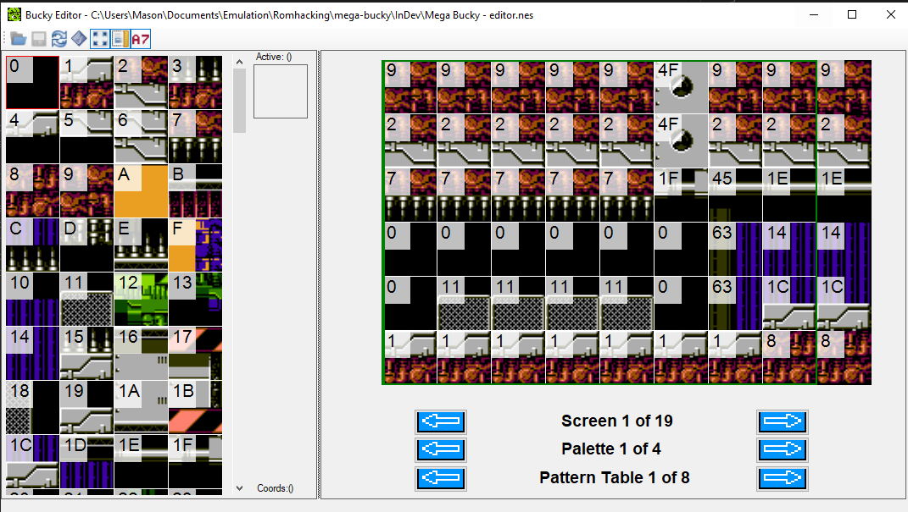
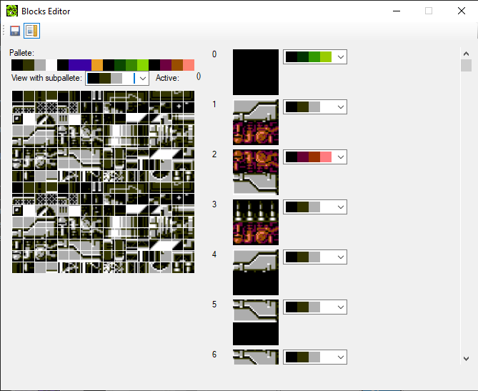

# Mega Bucky Devlog 3

## 1 Jan 2025

My long gap without working on this was partly due to discouragement at the thought of the tedium to how I was editing levels - so I finally made more of an effort to seek out a level editor. I found one that looks promising, but want to modify the source code to better suit my needs and work out some issues it has. So today's work was spent on stripping it down a bit, but there remains work to do on that front still.

## 2-8 Jan 2025

Continued refactoring of level editor. I coincidentally worked on it a few days in a row, until realizing it might be nice to do that on purpose, so for now I'm focusing on making smaller edits each day.

## 9 Jan 2025

Milestone in the level editor reached - it's now loading palettes and tiles directly from ROM! Previously, it loaded these from a fixed binary file, so they would never be up to date with my edits.

## 10 Jan 2025

Updated the level editor palette colors to match the Mesen emulator colors.

## 11-16 Jan 2025

Creating new config files for the levels to use in the level editor.

## 17-20 Jan 2025

Additional enhancements to level editor to accomodate some special level cases. I re-implemented the ability to select different palette and pattern table sets as buttons (and different internal loading logic); these were formerly under the "Advanced" checkbox. Screens are also buttons instead of a dropdown box now.

## 21 Jan 2025

Converted more things to icons. First, the show metatile address checkbox from above:

I did a similar thing for the metatile editor, which didn't have image based buttons at all, and also added the ability to toggle gridlines:

## 22 Jan 2025

Initially I thought the level editor was in a good enough state to take a break from working on it and actually _edit_ levels, but I got hit with writer's block pretty fast. I made some minor changes not worth showing yet. I also realized that the editor still could greatly benefit from some features I initiallly thought of as "nice to have". So updates going forward will probably be a mix of actual game work and work on my editor.